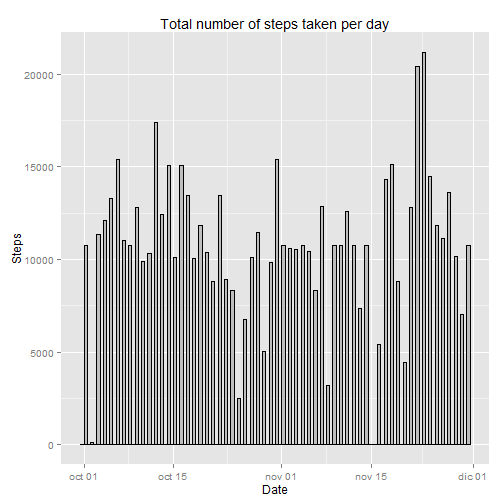

It is now possible to collect a large amount of data about personal movement using activity monitoring devices such as a Fitbit, Nike Fuelband, or Jawbone Up. These type of devices are part of the "quantified self" movement - a group of enthusiasts who take measurements about themselves regularly to improve their health, to find patterns in their behavior, or because they are tech geeks. But these data remain under-utilized both because the raw data are hard to obtain and there is a lack of statistical methods and software for processing and interpreting the data.

This assignment makes use of data from a personal activity monitoring device. This device collects data at 5 minute intervals through out the day. The data consists of two months of data from an anonymous individual collected during the months of October and November, 2012 and include the number of steps taken in 5 minute intervals each day.

## Loading and preprocessing the data
1. The process verifies if the zip file with the collected data has already been downloaded and, if not, it gets it from the specified URL.
2. The file is unzipped to get the CSV file.
3. The process loads the data set in a variable called *activity*. The NA values are asigned using the "NA" string and the column "date" is formated as date data.


```r
if(!file.exists("activity.zip")) {
  download.file(
    "https://d396qusza40orc.cloudfront.net/repdata%2Fdata%2Factivity.zip",
    "activity.zip")
}

if(!file.exists("activity.csv")) {
  unzip("activity.zip")
}

activity <- read.csv("activity.csv", header = TRUE, na.strings = "NA")

activity[,2] <- as.Date(activity[,2], "%Y-%m-%d")
```


## What is mean total number of steps taken per day?

The total number of steps taken per day is represented as follows:


```r
totalSteps <- ddply(
              activity, 
              ~date, 
              summarise, 
              totalsteps = sum(steps, na.rm = TRUE))

qplot(
  date,
  weight = totalsteps,
  data = totalSteps,
  xlab = "Date",
  ylab = "Steps",
  main = "Total number of steps taken per day",
  fill=I("grey"),
  col=I("black"),
  binwidth = 0.5,
  geom="histogram")
```

 

And here we have the mean and median of the total number of steps taken per day:


```r
stepMeanByDate <- ddply(
              na.omit(activity), 
              ~date, 
              summarise, 
              mean = mean(steps, na.rm = TRUE),
              median = median(unique(steps), na.rm = TRUE))
names(stepMeanByDate) <- c("Date", "Mean Steps", "Median Steps")
print(stepMeanByDate)
```

```
##          Date Mean Steps Median Steps
## 1  2012-10-02  0.4375000          9.0
## 2  2012-10-03 39.4166667         75.0
## 3  2012-10-04 42.0694444         77.5
## 4  2012-10-05 46.1597222         70.0
## 5  2012-10-06 53.5416667         84.5
## 6  2012-10-07 38.2465278         72.5
## 7  2012-10-09 44.4826389         61.0
## 8  2012-10-10 34.3750000         70.5
## 9  2012-10-11 35.7777778         47.5
## 10 2012-10-12 60.3541667         90.5
## 11 2012-10-13 43.1458333         69.0
## 12 2012-10-14 52.4236111         68.5
## 13 2012-10-15 35.2048611         68.0
## 14 2012-10-16 52.3750000         83.0
## 15 2012-10-17 46.7083333         76.5
## 16 2012-10-18 34.9166667         63.0
## 17 2012-10-19 41.0729167         88.0
## 18 2012-10-20 36.0937500         52.5
## 19 2012-10-21 30.6284722         56.0
## 20 2012-10-22 46.7361111         76.0
## 21 2012-10-23 30.9652778         71.0
## 22 2012-10-24 29.0104167         62.0
## 23 2012-10-25  8.6527778         39.0
## 24 2012-10-26 23.5347222         54.0
## 25 2012-10-27 35.1354167         82.0
## 26 2012-10-28 39.7847222         73.0
## 27 2012-10-29 17.4236111         56.0
## 28 2012-10-30 34.0937500         57.0
## 29 2012-10-31 53.5208333         96.5
## 30 2012-11-02 36.8055556         70.0
## 31 2012-11-03 36.7048611         67.0
## 32 2012-11-05 36.2465278         69.5
## 33 2012-11-06 28.9375000         63.5
## 34 2012-11-07 44.7326389         70.0
## 35 2012-11-08 11.1770833         45.0
## 36 2012-11-11 43.7777778         64.5
## 37 2012-11-12 37.3784722         55.0
## 38 2012-11-13 25.4722222         67.5
## 39 2012-11-15  0.1423611          8.0
## 40 2012-11-16 18.8923611         54.0
## 41 2012-11-17 49.7881944         76.0
## 42 2012-11-18 52.4652778         87.5
## 43 2012-11-19 30.6979167         42.0
## 44 2012-11-20 15.5277778         60.0
## 45 2012-11-21 44.3993056         65.5
## 46 2012-11-22 70.9270833         74.0
## 47 2012-11-23 73.5902778        245.0
## 48 2012-11-24 50.2708333         76.5
## 49 2012-11-25 41.0902778         93.0
## 50 2012-11-26 38.7569444         58.0
## 51 2012-11-27 47.3819444         61.0
## 52 2012-11-28 35.3576389         69.0
## 53 2012-11-29 24.4687500         55.0
```

## What is the average daily activity pattern?


```r
stepMeanByInt <- ddply(
                  activity, 
                  .(interval), 
                  summarise, 
                  mean = mean(steps, na.rm = TRUE))

qplot(
    	interval, 
			y = mean, 
			data = stepMeanByInt, 
			xlab = "Interval", 
			ylab = "Steps",
			main = "Average daily activity pattern",
			geom = "line")
```

 

And we can calculate the max interval row:


```r
stepMeanByInt[which.max(stepMeanByInt[,2]),]
```

```
##     interval     mean
## 104      835 206.1698
```

## Imputing missing values
The total number of missing values in the dataset is:


```r
nrow(activity[is.na(activity[,1]),])
```

```
## [1] 2304
```

We replace the NA values in the steps variable with the mean for the given interval.


```r
cleanActivity <- activity
cleanActivity[,1] <- apply(
                      cleanActivity, 
                      FUN = function(x) 
                        if(is.na(x[["steps"]])) 
                          stepMeanByInt[stepMeanByInt$interval == as.numeric(x[["interval"]]),2] 
                        else 
                          as.numeric(x[["steps"]]), 
                      MARGIN = 1)
nrow(cleanActivity[is.na(cleanActivity[,1]),])
```

```
## [1] 0
```

And now we can observe how the mean and median total number of steps taken per day have changed and now we have data on days where there was nothing before:


```r
totalSteps <- ddply(
              cleanActivity, 
              ~date, 
              summarise, 
              totalsteps = sum(steps))

qplot(
  date,
  weight = totalsteps,
  data = totalSteps,
  xlab = "Date",
  ylab = "Steps",
  main = "Total number of steps taken per day",
  fill=I("grey"),
  col=I("black"),
  binwidth = 0.5,
  geom="histogram")
```

 

## Are there differences in activity patterns between weekdays and weekends?

First of all, we need to add the weekday variable as factor to the new cleaned dataset


```r
cleanActivity$weekday <- apply(
                          cleanActivity, 
                          FUN = function(x) {
                            day <- as.POSIXlt(x[["date"]])$wday
                            if(day == 0 | day == 6)  { # 0 - Sunday, 6 - Saturday
                              "weekend"
                            } else {
                              "weekday"
                            }
                           }, 
                          MARGIN = 1)
cleanActivity$weekday <- factor(cleanActivity$weekday, labels = c("weekday","weekend"))
```

And then, we have  the average number of steps taken across weekdays and weekends grouped by interval.


```r
stepMeanByInt <- ddply(
                  cleanActivity, 
                  .(interval, weekday), 
                  summarise, 
                  mean = mean(steps))

plot <- qplot(
        interval, 
        mean, 
        data=stepMeanByInt, 
        xlab = "Interval", 
        ylab = "Steps",
        geom = "line",
        main = "Average daily activity pattern across weekdays and weekends")  
plot <- plot +  facet_wrap(~weekday, nrow=2) 
plot + geom_line(color = "blue")
```

 
